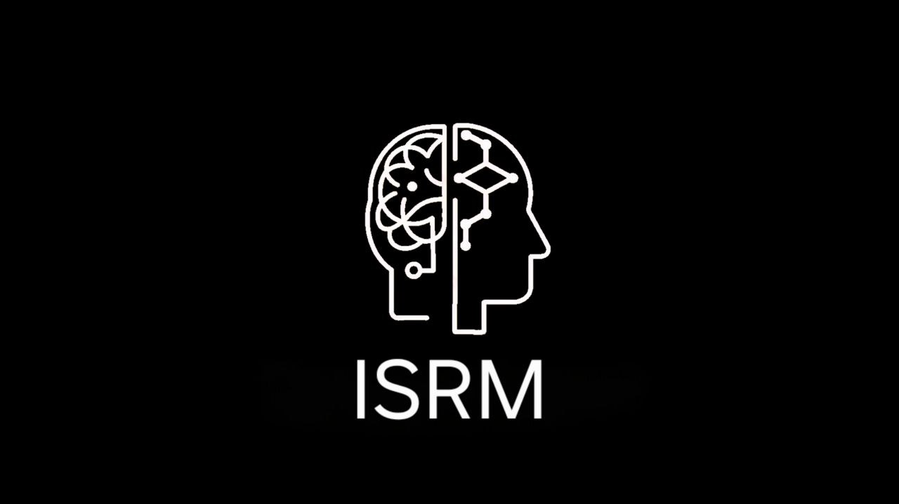

<div align="center">
  
</div>

# 🧠 ISRM: Internal State Reasoning Module

### Steerable Open-Endedness in LLMs via Variational Latent State Modeling

[](https://pytorch.org/)
[](https://huggingface.co/)

**ISRM** is a novel "Sidecar Architecture" that decouples an agent's **internal psychological state** from its **linguistic generation**. By injecting continuous, psychometrically valid latent vectors (PAD & BDI models) into a frozen Large Language Model, ISRM enables precise steerability and behavioral diversity without the need for expensive fine-tuning of the base LLM.

-----

## 🚀 Key Features

  * **🧠 Decoupled Brain & Body:** Uses a trainable **VAE Encoder** (DistilBERT-based) to model "feelings" and a frozen **LLM Body** (Dolphin-2.9.2-Qwen2-7B or Qwen2.5-1.5B) to express them.
  * **🎛️ Geometric Steering:** Control agent behavior via an 8-dimensional continuous latent space (Pleasure, Arousal, Dominance, etc.).
  * **🔓 Uncensored & Raw:** Optimized for **Dolphin-2.9.2-Qwen2-7B** to ensure commands (e.g., "Be Aggressive") are executed without safety refusals.
  * **🔬 Scientifically Benchmarked:** Includes a full evaluation suite for **Steerability** (Manipulation Score) and **Open-Endedness** (Distinct-N, Self-BLEU).

-----

## 🏗️ Architecture

The system follows a Teacher-Student distillation framework where the VAE learns to predict psychological states from dialogue context, which are then projected into the LLM's system instructions.

*(Architecture diagram placeholder)*

-----

## 🛠️ Installation

### Prerequisites

  * Python 3.10+
  * CUDA 12.x (Recommended)
  * GPU with 12GB+ VRAM (24GB recommended for unquantized loading of 7B models)

### 1\. Clone the Repository

```bash
git clone https://github.com/your-username/ISRM.git
cd ISRM
```

### 2\. Install Dependencies

```bash
pip install -r requirements.txt
```

-----

## ⚡ Quick Start

### 1\. Download the Model (Local Cache)

Since we are using large models, download them once to avoid connection issues.

```bash
python scripts/download_llm.py
```

### 2\. Run the Agent (CLI Chat)

Interact with the agent in the terminal. The system will display the **Internal State**, **Vector values**, and the **Response**.

```bash
python src/chat.py
```

### 3\. Run Scientific Benchmarks

Reproduce the metrics reported in the paper (Distinct-N, Manipulation Score, Self-BLEU).

```bash
python src/experiments.py
```

-----

## 📂 Project Structure

| File | Description |
| :--- | :--- |
| `src/model.py` | **The Brain.** Contains the `ISRM_Architected` class (VAE Encoder). |
| `src/alignment.py` | **The Bridge.** Handles LLM loading (Dolphin-2.9.2-Qwen2-7B), 4-bit/Flash Attention config, and vector-to-text projection. |
| `src/chat.py` | **Interaction.** A terminal-based chat interface to test the agent manually. |
| `src/experiments.py` | **Evaluation.** Automated script to generate tables for the research paper. |
| `src/train.py` | **Training.** Script to fine-tune the ISRM VAE module. |
| `scripts/download_llm.py` | **Utility.** Helper script to download models to `model/llm/`. |
| `scripts/test_llm.py` | **Utility.** Test the base LLM without ISRM. |
| `model/isrm/isrm_v3_finetuned.pth` | **Weights.** The latest trained weights of the VAE module. |
| `dataset/data_generator.py` | **Data.** Generates synthetic training dataset using Gemini. |
| `dataset/isrm_dataset_final.json` | **Dataset.** Training data for ISRM. |

-----

## 📊 Performance & Results

We evaluated ISRM against a standard baseline (Qwen-1.5B/GPT-2) using SOTA metrics from *Representation Engineering (Zou et al., 2023)*.

| Metric | ISRM + Dolphin | Baseline | Interpretation |
| :--- | :--- | :--- | :--- |
| **Manipulation Score** | *> 0.80 (High)* | ~0.10 (Random) | Higher is better (Steerability) |
| **Distinct-2** | *> 0.75 (Diverse)* | ~0.70 | Higher is better (Diversity) |
| **Self-BLEU** | *< 0.40* | ~0.30 | Lower is better (Repetitiveness) |

> **Note:** The high steerability score is achieved by using the **Dolphin** uncensored model, allowing the `System Instruction` to override default safety behaviors when the internal state dictates "Anger" or "Hostility."

Run `python src/experiments.py` to generate these metrics on your local setup.

-----

## 🧠 Methodology

### The 8-Dimensional Latent Space

Our encoder maps dialogue history to a vector $z \in \mathbb{R}^8$, derived from:

1.  **PAD Model (Affective):** Pleasure, Arousal, Dominance.
2.  **BDI Model (Cognitive):** Belief, Goal, Intention, Ambiguity, Social Adherence.

-----

## 📜 Citation

If you use this code or architecture, please cite:

```bibtex
@misc{isrm2025,
  author = {ISRM Team},
  title = {ISRM: Internal State Reasoning Module for Steerable LLMs},
  year = {2025},
  publisher = {GitHub},
  journal = {GitHub repository},
  howpublished = {\url{https://github.com/your-username/ISRM}}
}
```
